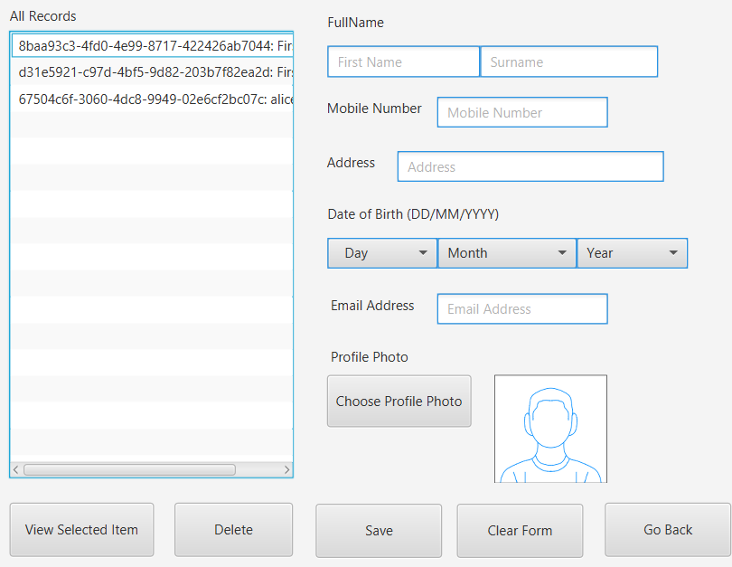
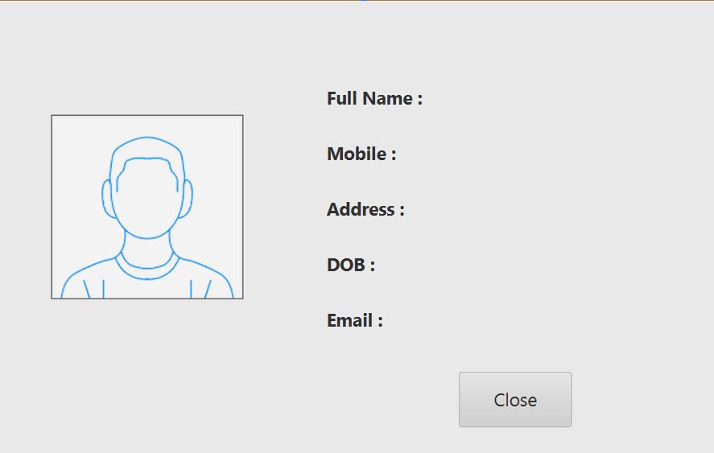

# Contacts Manager

## Overview
Contacts Manager is a desktop application built with JavaFX that allows users to manage personal contacts efficiently. Users can **add, view, and delete contacts**, with all information stored securely in a SQLite database. The application features a modern and intuitive UI with multiple views for different functionalities.

## Sample View

## Features
- **Add Contact**
  - Input fields for First Name, Surname, Mobile Number, Email, Address, and Date of Birth.
  - Option to select a profile picture.
  - Form validation ensures correct input formats.
  - Data is saved to both the **ListView** and the SQLite database.

- **View All Contacts**
  - Displays all saved contacts in a ListView.
  - Select a contact to **view detailed information** or **delete** it.
  - Dynamic updates ensure the list reflects the current database state.

- **Detail View**
  - Shows full contact information including profile picture.
  - Labels clearly indicate each field (e.g., `First Name: John Doe`).
  - Close button navigates back to the All Records view.

- **Navigation**
  - Seamless switching between Initial View, Add Contact, All Records, and Detail View.
  - Smooth transitions with a single application window.

- **User Experience**
  - Prompt text in input fields guides the user.
  - Focus management prevents unwanted blue outlines on buttons.
  - Error messages are displayed using alert dialogues.

## Project Structure
